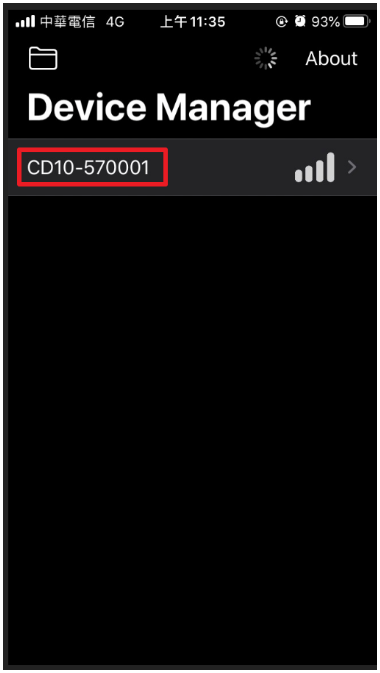
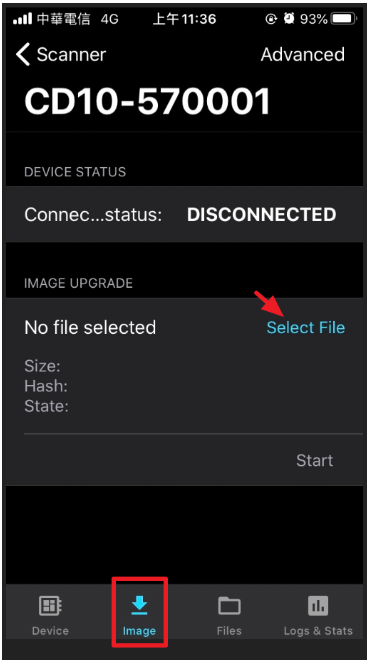
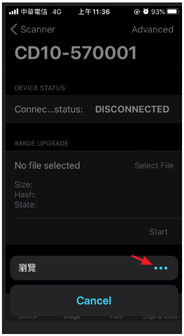
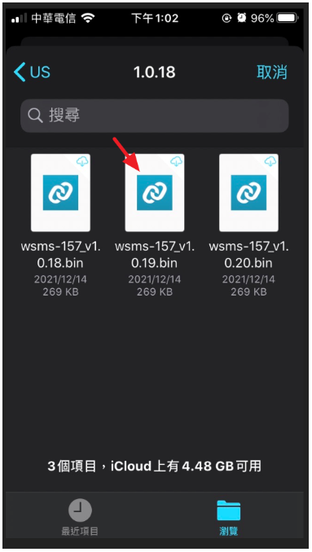
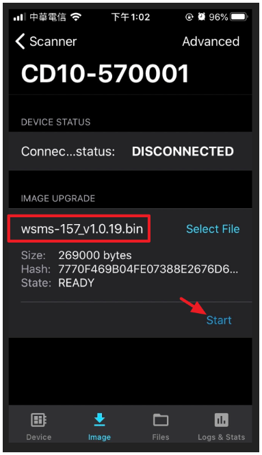
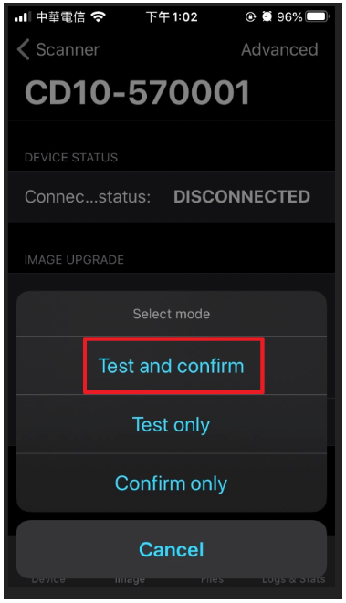
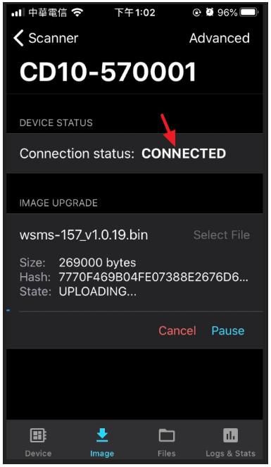
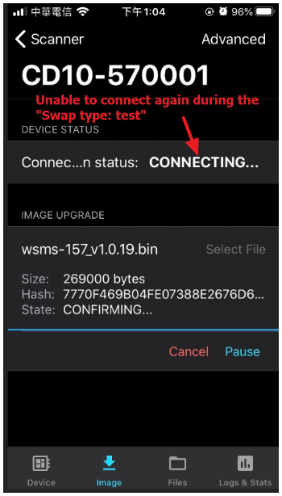
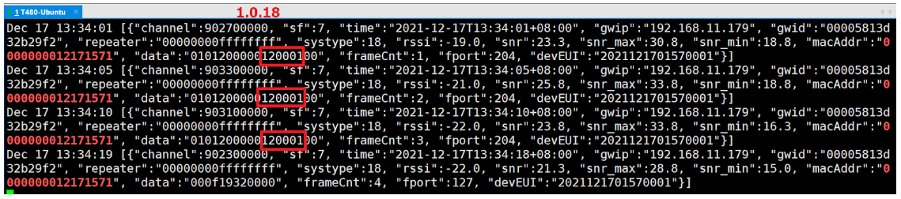

# MerryIoT Sensors

| Sensor Name               | Latest Version | Firmware List                                                                           |
|---------------------------|----------------|-----------------------------------------------------------------------------------------|
| WSMS-156 Motion Detection | v2.x.16        | [Firmware List](https://github.com/browanofficial/MerryIoT-Sensors/releases?q=wsms-156) |
| WSMS-157 Air Quality CO2  | v3.x.18        | [Firmware List](https://github.com/browanofficial/MerryIoT-Sensors/releases?q=wsms-157) |
| WSMS-158 Open/Close       | v2.x.9         | [Firmware List](https://github.com/browanofficial/MerryIoT-Sensors/releases?q=wsms-158) |
| WSMS-159 Leak Detection   | v2.x.11         | [Firmware List](https://github.com/browanofficial/MerryIoT-Sensors/releases?q=wsms-159) |

**The `x` in version is region code.**

Region code mapping table:

| Region Code | Region  |
|-------------|---------|
| 0           | US915   |
| 1           | EU868   |
| 2           | AS923-1 |
| 3           | AU915   |
| 8           | IN865   |
| 10          | AS923-2 |
| 11          | AS923-3 |

## How to upgrade firmware

1. Download Device Manager.

    **NOTE: There may be some differences between every OS version.**

    - iOS: <https://apps.apple.com/tw/app/nrf-connect-device-manager/id1519423539>
    - Android: <https://play.google.com/store/apps/details?id=no.nordicsemi.android.nrfconnectdevicemanager>

2. Download firmware BIN file and put into your device.

    - <https://github.com/browanofficial/MerryIoT-Sensors/releases>

3. Send downlink to make the DUT enter the DFU mode.

    - Port: 206
    - Payload: `444655`

4. Check the LED. Once the DUT enters the DFU mode, the LED will be flashed.

5. Launch the "Device Manager" app. The DUT will be found.

    DUT's naming rule:
    - [Model name]-[Latest 6 number of DevEUI]
    - DevEUI should be uppercase

    | Sensor Name               | Advertising Name Example |
    |---------------------------|--------------------------|
    | WSMS-156 Motion Detection | MS10-AA0102              |
    | WSMS-157 Air Quality CO2  | CD10-1122BB              |
    | WSMS-158 Open/Close       | DW10-22CA01              |
    | WSMS-159 Leak Detection   | WL10-0C1B1E              |

6. Select the BIN file to upgrade.

    **NOTE: If the BLE connection cannot be connected in one minute, DFU mode will be timeout.**

    

    

    

    

    

    

    

    **NOTE: DUT will reboot automatically after uploading.**

7. In the "CONFIRMING" state, the BLE connection should be connected automatically again. Or the "CONFIRMING state" will fail, then reboot again.

    

8. Please check the FW version via the uplink(Frame Count 1~3) payload.

    
